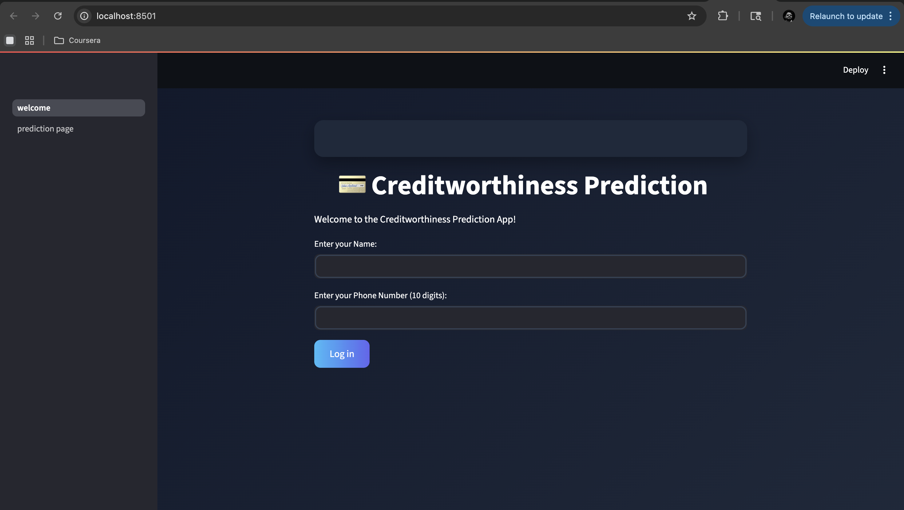
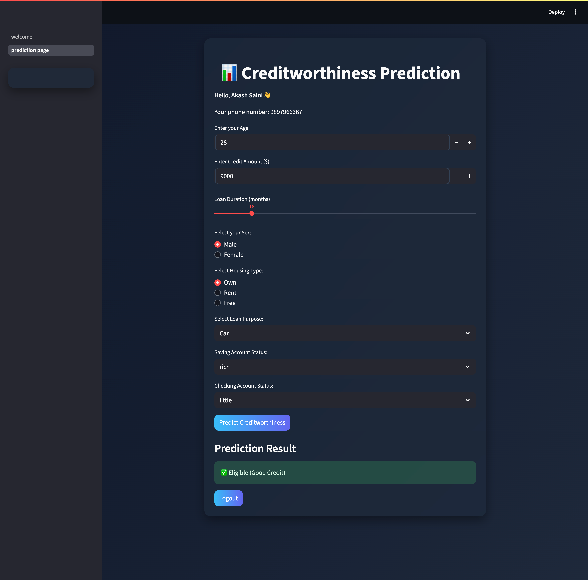

# 💳 Credit Risk Prediction System

A machine learning web application that predicts the **creditworthiness of loan applicants** based on financial and personal data. Built with Python, Scikit-learn, and Streamlit.

---

## 🚀 Live Demo

> Run locally using the steps below

---

## 📌 Features

- Predicts whether a loan applicant is **credit worthy or not**
- Interactive web interface built with **Streamlit**
- Trained on real-world German credit dataset
- Clean and intuitive UI for inputting applicant data
- Instant prediction results

---

## 🛠️ Tech Stack

| Layer | Technology |
|-------|-----------|
| Language | Python 3.10 |
| ML Library | Scikit-learn |
| Web Framework | Streamlit |
| Data Processing | Pandas, NumPy |
| Model Persistence | Pickle |
| Dataset | German Credit Data |

---

## 📂 Project Structure

```
credit_risk_prediction/
│
├── ML_project/
│   └── ML_Projects/
│       ├── Creditworthiness.ipynb     # Model training notebook
│       ├── creditworthiness.py        # Core ML logic
│       └── sample.py                  # Sample predictions
│
├── pages/
│   └── prediction_page.py             # Streamlit prediction page
│
├── welcome.py                         # Main Streamlit app entry point
├── credit_risk.py                     # Credit risk logic
├── train_model.py                     # Model training script
├── credit_risk_model.pkl              # Saved trained model
├── german_credit_data2.csv            # Training dataset
├── updated_dataset.csv                # Processed dataset
└── requirements.txt                   # Python dependencies
```

---

## ⚙️ Installation & Setup

### 1. Clone the repository
```bash
git clone https://github.com/akash-learns-coding/Credit_risk_prediction_system.git
cd Credit_risk_prediction_system
```

### 2. Create a virtual environment
```bash
python -m venv venv
source venv/bin/activate        # On Mac/Linux
venv\Scripts\activate           # On Windows
```

### 3. Install dependencies
```bash
pip install -r requirements.txt
```

### 4. Run the app
```bash
streamlit run welcome.py
```

The app will open at `http://localhost:8501`

---

## 🧠 How It Works

1. **Data Collection** — Uses the German Credit Dataset with 1000 entries
2. **Preprocessing** — Handles missing values, encodes categorical features
3. **Model Training** — Trained a classification model using Scikit-learn
4. **Prediction** — Takes user input via Streamlit UI and returns credit risk prediction
5. **Result** — Classifies applicant as **Good Credit Risk** or **Bad Credit Risk**

---

## 📊 Dataset

- **Source:** German Credit Data
- **Records:** 1000 applicants
- **Features:** Age, job, housing, credit amount, duration, purpose, etc.
- **Target:** Credit risk classification (Good / Bad)

---

## 📸 Screenshots

> 
> 

---

## 🤝 Contributing

Pull requests are welcome! For major changes, please open an issue first to discuss what you'd like to change.

---

## 👨‍💻 Author

**Akash Saini**
- GitHub: [@akash-learns-coding](https://github.com/akash-learns-coding)

---

## 📄 License

This project is open source and available under the [MIT License](LICENSE).
